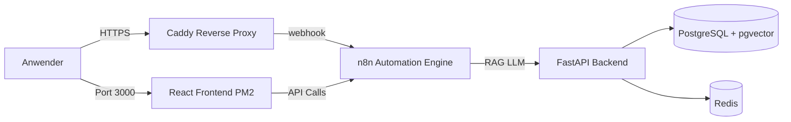

# Process Modeler - Bachelor Thesis

Intelligente Automatisierung von Prozessmodellierung (Text-to-BPMN) basierend auf Verwaltungsvorschriften.

**Live Demo:** [http://209.38.205.46:3000](http://209.38.205.46:3000)  
**n8n Workflow Engine:** [https://209.38.205.46.nip.io](https://209.38.205.46.nip.io)

---

## 🏗️ Architektur

Das System folgt einer Microservice-Architektur auf einem Digital Ocean Droplet.


---

## 🚀 Quick Start

### 1. Lokale Entwicklung (Mac/Linux/Windows)
```bash
git clone https://github.com/amue11er/process-modeller-thesis.git
cd process-modeller-thesis

# Docker Services starten (PostgreSQL, Redis, n8n)
docker-compose up -d

# Frontend starten
cd apps/frontend-react
npm install
npm start
# → http://localhost:3000
```

### 2. Production Server (Digital Ocean)

Das Produktivsystem nutzt **PM2** für das Frontend (Static Build) und **Docker Compose** für das Backend.

> ⚠️ **WICHTIG:** Auf dem Server niemals `npm start` verwenden (Out-of-Memory Gefahr).

#### Erstinstallation (Einmalig)
```bash
ssh root@209.38.205.46

# 1. Swap aktivieren (Essenziell für Stabilität bei <4GB RAM!)
# Verhindert Abstürze beim Build-Prozess
grep -qxF '/swapfile none swap sw 0 0' /etc/fstab || (fallocate -l 2G /swapfile && chmod 600 /swapfile && mkswap /swapfile && swapon /swapfile && echo '/swapfile none swap sw 0 0' >> /etc/fstab)

# 2. Tools installieren
npm install -g pm2 serve

# 3. Projekt klonen & Backend starten
cd /opt
git clone https://github.com/amue11er/process-modeller-thesis.git
cd process-modeller-thesis
docker-compose up -d

# 4. Frontend bauen & via PM2 starten
cd apps/frontend-react
npm install
# Memory-Limit erhöhen für den Build (Verhindert Heap Out Of Memory):
NODE_OPTIONS="--max-old-space-size=2560" npm run build
# PM2 Service starten
pm2 serve build 3000 --name "frontend" --spa
pm2 save
pm2 startup
```

---

## 🔄 Update Workflow (Redeployment)

Wenn neuer Code auf GitHub gepusht wurde, führen Sie diese Schritte auf dem Server aus:
```bash
ssh root@209.38.205.46
cd /opt/process-modeller-thesis

# 1. Code holen
git pull origin main

# 2. Backend Services aktualisieren (falls nötig)
docker-compose up -d --build

# 3. Frontend neu bauen
cd apps/frontend-react
npm install
# WICHTIG: Immer mit Memory-Flag bauen!
NODE_OPTIONS="--max-old-space-size=2560" npm run build

# 4. Frontend neu laden (Zero Downtime)
pm2 reload frontend

# 5. Gesundheits-Check (Container neustarten, falls OOM Killer aktiv war)
cd /opt/process-modeller-thesis
docker-compose up -d
```

---

## 📦 Services

| Service | Port | URL | Status | Beschreibung |
| --- | --- | --- | --- | --- |
| **Frontend** | 3000 | http://209.38.205.46:3000 | ✅ Online | React UI (via PM2) |
| **n8n** | 5678 | https://209.38.205.46.nip.io | ✅ Online | Workflow Automation |
| **PostgreSQL** | 5432 | internal | ✅ Online | DB + pgvector |
| **Redis** | 6379 | internal | ✅ Online | Cache |
| **Caddy** | 80/443 | - | ✅ Online | Reverse Proxy / SSL |
| **Portainer** | 9000 | - | Optional | Docker Management |

---

## 🔧 Troubleshooting

### Frontend Build stürzt ab ("JavaScript heap out of memory")

Der Server hat zu wenig physischen RAM für den Build-Prozess.
**Lösung:** Swap aktivieren (siehe oben) und Build mit Flag starten:
```bash
NODE_OPTIONS="--max-old-space-size=2560" npm run build
```

### n8n ist nicht erreichbar ("502 Bad Gateway")

Oft pausiert das System Docker-Container, wenn das Frontend gebaut wird, um RAM zu sparen.
**Lösung:** Container einfach wieder wecken:
```bash
cd /opt/process-modeller-thesis
docker-compose up -d
```

### Frontend lädt ewig oder zeigt Fehler

**Checks:**

1. Läuft PM2? `pm2 list` (Muss "online" sein)
2. Läuft der Dienst auf Port 3000? `ss -tulpn | grep 3000`

---

## 🛠️ Tech Stack

| Component | Technology |
| --- | --- |
| **Frontend** | React 19, Tailwind CSS, bpmn-js |
| **Backend** | FastAPI (Python) |
| **Database** | PostgreSQL + pgvector |
| **Workflows** | n8n (Low-Code) |
| **Deployment** | Docker Compose + PM2 |
| **Proxy** | Caddy (Auto-SSL) |

---

## 📄 License

MIT License
